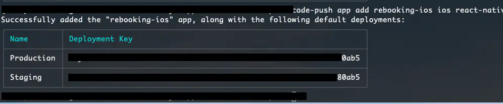
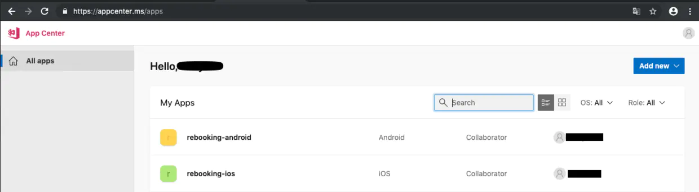
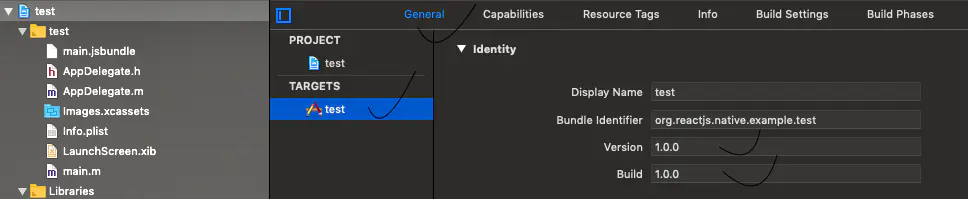
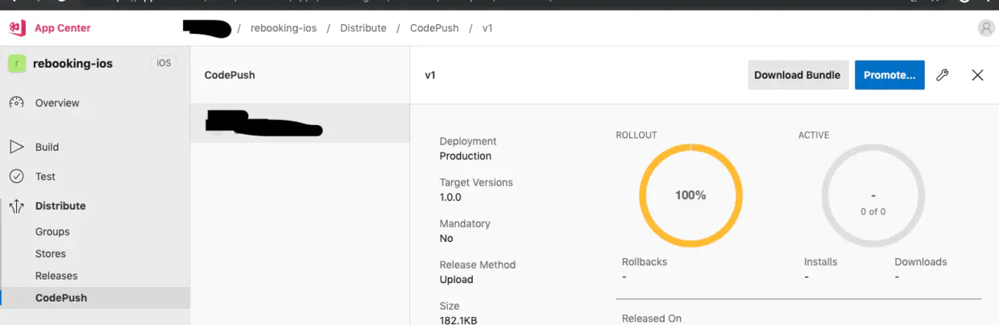

#### 1. 安装 CodePush CLI
```
npm install -g code-push-cli
```

#### 2. 注册 CodePush 账号
```
code-push register
```
> ⚠️ 这里会弹出一个网页选择 `github` 授权， 注册成功后会得到一个 `key` , 将 `key` 复制到终端回车

#### 3. 添加 ios 平台应用
```
code-push app add rebooking-ios ios react-native
```
得到下面的两个 `key` ， 后面会用到




#### 4. 添加 android 平台应用
```
code-push app add rebooking-android android react-native
```
得到的东西和 ios 一样


进入 [https://appcenter.ms/](https://appcenter.ms/) 可以看到你刚才创建的app， 如下图



---
##### 下面开始整合到 react-native

#### 5. react-native 中安装 code-push 组件
```
npm install react-native-code-push --save
```

#### 6. 添加原生依赖， 使用 link 到 android 和 ios 中
```
react-native link react-native-code-push
```
> 如果 `link` 的时候出现 `rnpm-install ERR! ERRPACKAGEJSON No package found. Are you sure this i a React Native project?
Package name not found in ...`等， 请使用新版本的`react-native` 版本```react-native init MyApp --version 0.59.5``` 我这里使用 59

运行react-native link的时候，命令行会提示输入部署码`What is your CodePush deployment key for Android (hit <ENTER> to ignore)`
这个时候将你`Android` 中 `Production` 的 `Deployment Key` 粘贴回程。 `ios` 同理。

#### 7. 将 Android 和 ios 的版本号改为 1.0.0




#### 8. 在 react-native 项目中的首页中 使用 code-push
```
/**
 * Sample React Native App
 * https://github.com/facebook/react-native
 *
 * @format
 * @flow
 */

import React, {Component} from 'react';
import {Platform, StyleSheet, Text, View} from 'react-native';
import CodePush from "react-native-code-push";
const instructions = Platform.select({
  ios: 'Press Cmd+R to reload,\n' + 'Cmd+D or shake for dev menu',
  android:
    'Double tap R on your keyboard to reload,\n' +
    'Shake or press menu button for dev menu',
});

export default class App extends Component {

  componentDidMount(){
    CodePush.sync({
      //安装模式
      //ON_NEXT_RESUME 下次恢复到前台时
      //ON_NEXT_RESTART 下一次重启时
      //IMMEDIATE 马上更新
      installMode : CodePush.InstallMode.IMMEDIATE ,
      //对话框
      updateDialog : {
          //是否显示更新描述
          appendReleaseDescription : true ,
          //更新描述的前缀。 默认为"Description"
          descriptionPrefix : "更新内容：" ,
          //强制更新按钮文字，默认为continue
          mandatoryContinueButtonLabel : "立即更新" ,
          //强制更新时的信息. 默认为"An update is available that must be installed."
          mandatoryUpdateMessage : "必须更新后才能使用" ,
          //非强制更新时，按钮文字,默认为"ignore"
          optionalIgnoreButtonLabel : '稍后' ,
          //非强制更新时，确认按钮文字. 默认为"Install"
          optionalInstallButtonLabel : '后台更新' ,
          //非强制更新时，检查到更新的消息文本
          optionalUpdateMessage : '有新版本了，是否更新？' ,
          //Alert窗口的标题
          title : '更新提示'
        }
      }
    );
  }

  render() {
    return (
      <View style={styles.container}>
        <Text style={styles.welcome}>Welcome to React Native!</Text>
        <Text style={styles.instructions}>To get started, edit App.js</Text>
        <Text style={styles.instructions}>{instructions}</Text>
      </View>
    );
  }
}
```

#### 9. 发布更新
```
code-push release-react rebooking-ios ios -d Production
code-push release-react rebooking-android android -d Production
```
最后打开手机查看效果



> 关于自定义更新弹框 ，参照下面的文章


